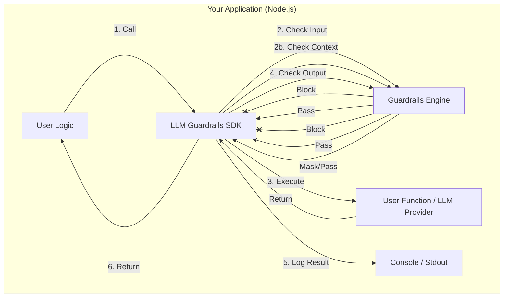

# LLM Guardrails SDK

> **Enterprise-grade in-process instrumentation for securing and observing LLM applications.**


This library provides a unique, drop-in SDK for Large Language Model (LLM) guardrails. It instruments your application directly to automatically enforce security guardrails and observe guardrail performance without any external infrastructure dependencies.

## 🚀 Features

### 🛡️ Guardrails & Security
- **In-Process Protection**: Validates inputs and outputs directly within your application process with zero network latency.
- **PII Detection & Masking**: Automatically redacts sensitive data (Email, Phone, Credit Cards) from model responses based on configurable policies.
- **Secret Detection**: Blocks requests containing API keys or private tokens before they reach the model.
- **Toxicity Detection**: Filters harmful content using local models (BERT) or OpenAI Moderation API.
- **Language Allowlist Enforcement**: Restricts prompts/responses to approved languages for locale or policy compliance.
- **Tool Access Guardrails**: Blocks disallowed tool usage via context-phase validation before model execution.
- **Hallucination Signal Detection**: Flags unsupported “factual authority” claims when citation/source signals are missing.
- **Schema Validation & Repair**: Ensures outputs match JSON schemas and automatically repairs malformed JSON.
- **Policy as Code**: Define rules in `YAML` files that live with your code.

### 🤖 Reliability & Control
- **Automatic Retries**: Automatically re-prompts the LLM if output validation fails (e.g., invalid JSON), up to a configurable limit.
- **Flexible Actions**: Configure actions like `reject`, `flag`, `mask`, or `retry` for each guardrail.

### 👁️ Guardrail Observability
- **Real-time Logging**: Automatically logs guardrail checks (Pass/Fail/Violations) to the console for easy monitoring.
- **Violation Tracking**: Detailed logs for blocked requests or masked content.

## 🏗️ Architecture

The SDK runs entirely within your application process, wrapping your LLM calls to enforce security policies and log activity across **three phases**:
1. **Input** guardrails before provider invocation.
2. **Context** guardrails (e.g., requested tools, metadata controls) before provider invocation.
3. **Output** guardrails after the provider responds.


```mermaid
graph TD
    subgraph "Your Application (Node.js)"
        UserCode[User Logic] -->|1. Call| SDK[LLM Guardrails SDK]
        
        SDK -->|2. Check Input| Guardrails[Guardrails Engine]
        Guardrails --x|Block| SDK
        Guardrails -->|Pass| SDK

        SDK -->|2b. Check Context| Guardrails
        Guardrails --x|Block| SDK
        Guardrails -->|Pass| SDK
        
        SDK -->|3. Execute| UserFunc[User Function / LLM Provider]
        UserFunc -->|Return| SDK
        
        SDK -->|4. Check Output| Guardrails
        Guardrails -->|Mask/Pass| SDK
        
        SDK -->|5. Log Result| Console[Console / Stdout]
        SDK -->|6. Return| UserCode
    end
```

## 🛠️ Getting Started

### Prerequisites
- **Node.js 20+**

### 1. Installation

```bash
npm install
```

### 2. Use the SDK in Your App

Initialize the SDK and wrap your LLM calls.

```javascript
import llm from '@llm-governance/sdk';

// 1. Initialize with your policy
llm.init({
    policyPath: './path/to/guardrails.yml'
});

// 2. Wrap your LLM calls
const response = await llm.observe({
    input: "User prompt",
    model: "gpt-4", // optional
    provider: "openai", // optional
    maxRetries: 3, // Enable retries for validation failures
    metadata: { user_id: "123" }
}, async () => {
    // Your existing code (e.g., OpenAI SDK)
    return await openai.chat.completions.create({
        model: "gpt-4",
        messages: [{ role: "user", content: "User prompt" }]
    });
});
```

## ⚙️ Configuration

### Guardrails Policy
Define your security rules in a YAML file (e.g., `policies/default.yml`):

```yaml
input:
  secrets_detection:
    enabled: true
    action: reject

context:
  tool_access:
    enabled: true
    action: reject
    allowed_tools:
      - web_search
      - calculator

output:
  language_allowlist:
    enabled: true
    action: reject
    allowed_languages: [en]

  hallucination_detection:
    enabled: true
    action: flag

  pii_detection:
    enabled: true
    categories: [email, phone]
    action: mask
    mask_token: "[REDACTED]"

  toxicity_detection:
    enabled: true
    provider: 'openai' # or 'local'
    action: reject

  schema_validation:
    enabled: true
    action: retry # Automatically retry if schema validation fails
```

## 🧭 Suggested Next Enhancements

If you want to continue evolving the guardrails stack, these are high-impact additions:

- **Implement `factuality_check`** as a non-noop validator with retrieval/citation-aware scoring.
- **Add `usage` enforcement** (`cost_guardrails`, `rate_limits`) at runtime, not just policy definition.
- **Add domain compliance packs** (e.g., finance/healthcare) with claim constraints and safe response templates.
- **Expand citation policy modes** (e.g., `required_for_claims`, `required_for_numbers`, `always`) for lower false positives.

## 🤝 Contributing
We welcome contributions! Please see [CONTRIBUTING.md](CONTRIBUTING.md) for details.

## 📄 License
MIT License. See [LICENSE](LICENSE) for details.
